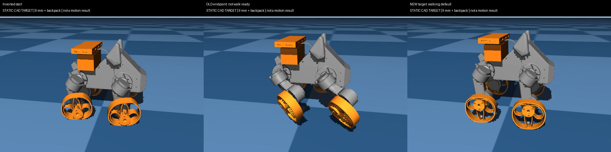

# Initial simultaneous-roll result

**The direct all-forward candidate passed the new preliminary simulation checks.**
It ends near the selected walking policy's default pose, rather than the previous
sequential routine's asymmetric endpoint. This is one nominal feasibility run,
not robustness or walking-policy handoff validation.

- Model: original leg CAD, original tip and 9 mm additional gap, plus the newly
  added 0.601917 kg backpack. Total model mass 3.792637 kg.
- Motion: 2 s initial hold, 12 s simultaneous roll, 5 s final hold; 9,880 physics
  steps at 520 Hz. No state resets during the trajectory.
- All four commands finish at the exact policy defaults. Final measured maximum
  joint error is 0.03016 rad (1.728 degrees), including unwrapped hub coordinates.
- Final body height 146.72 mm; forward travel about 132.37 mm. Body height rises
  about 29.89 mm relative to the initial model pose.
- Peak body tilt 0.864 degrees, peak requested torque 0.771 Nm, and zero sampled
  motor/body floor force. All four tips are supported through the final 3 s check.
- Minimum detailed CAD gap sampled every 0.1 s: 2.789 mm. This is not a dense
  clearance certification. No contact-force/impulse or walking handoff gate was
  silently inferred from this number.

[W&B actual motion videos and artifacts](https://wandb.ai/QuadMorph/wheel-leg%20lift%20and%20align%20triangle%20base/runs/1012efb07cfc4537)
contains `trajectory/all_forward_direct` and the three comparisons. The run has
no trained checkpoint: these are deterministic trajectory probes. Downloaded
cloud bytes and artifact state are recorded in `cloud_verification.json`.

| Probe | Preliminary result | Maximum tilt | Motor/body floor force |
| --- | --- | ---: | ---: |
| All forward, direct to walking default | Pass | 0.864 deg | 0 N |
| All backward, direct to walking default | Pass | 0.543 deg | 0 N |
| Forward, early proximal adjustment | Pass | 0.970 deg | 0 N |
| Forward, late proximal adjustment | Fail; stopped at 8.152 s | 36.210 deg | 37.652 N |

All four audits, low-rate state recordings and traces are retained. The failed
case is preserved in W&B Media, not replaced by a successful video. Initial
source hashes are in `provenance.json`; the executed probe implementation is
preserved at commit `45c2d90`. The next revision fixes a zero-gap accumulator
edge case; none of these runs reported a CAD intersection or a zero CAD gap.

This image compares **static** poses, not three rollout outcomes. The orange
limbs are the exact `CustomLegFoot.stl` from the leg model. The new target is read
from `policy_walk_v2.json`; the previous endpoint comes from the preserved
`8904c2a` policy-compatibility report. The backpack is shown in each comparison.

Next work is listed in [the experiment contract](../../ROLL_TO_STAND.md) and
[the PC handoff](../../ROLL_TO_STAND_PC_HANDOFF.md). Do not deploy this candidate
to the current Pi controller or treat its old triangle mapping as compatible.
