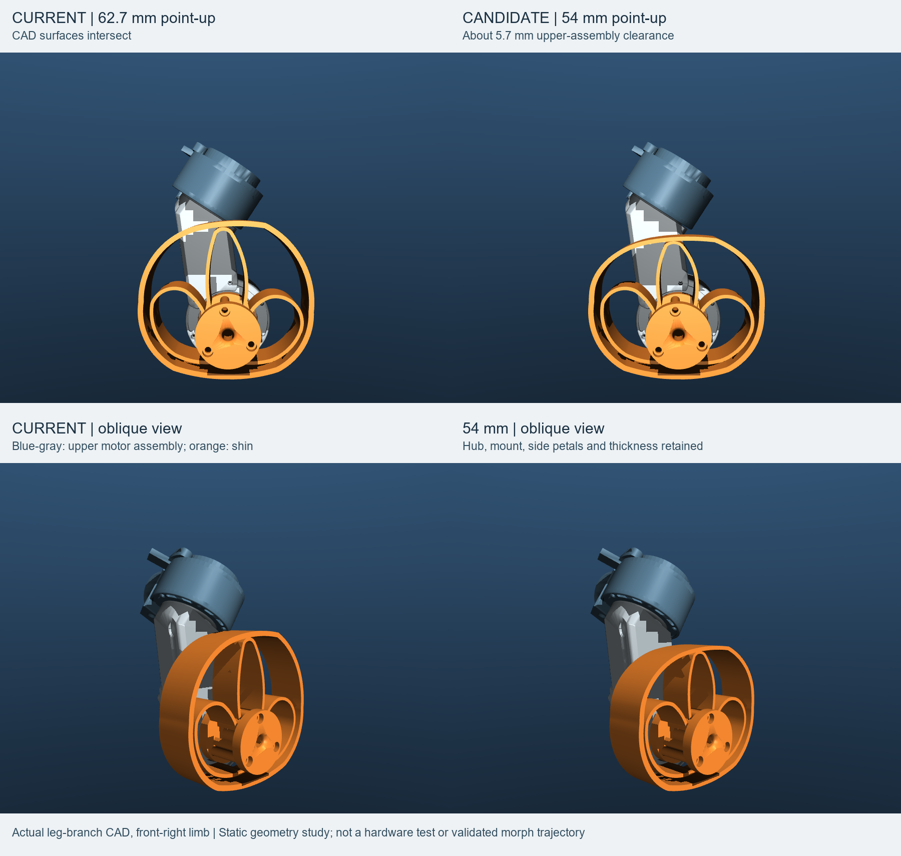
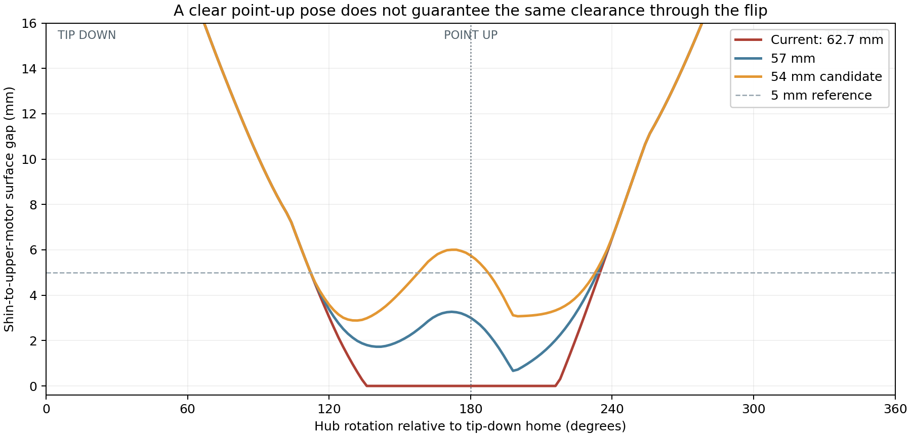

# Point-up shin clearance: geometry findings

Date: 11 September 2026. Scope: step 1 only, measuring and proposing shin geometry. Heating stays manual. No robot startup, hardware commands, policy training, alignment changes or robot-code refactor work was performed.

## Result

The existing point-up shin intersects the upper motor assembly in the `leg` branch CAD. Its outer tip extends **62.694 mm along the tip direction from the hub axis**. In the specified neutral pose, approximately **60.439 mm** is the touching boundary: about **2.255 mm of shortening** removes that intersection.

For a starting geometry candidate, **54 mm** gives about **5.750 mm separation while pointing up**. The complete sampled half-turns reduce that margin to about **2.875 mm**, so the point-up figure must not be treated as the margin throughout the motion.

These are model measurements, not caliper measurements or physical-motion validation.

## What was measured

- Source: [leg XML](https://github.com/TundTT/Pupper_animation/blob/6b55e30ff224193a2a21c8dc3dbb88e029a417c8/Stanford/training/pupper_v3_description/description/mujoco_xml/pupper_v3_complete.mjx.position.xml#L115), commit `6b55e30ff224193a2a21c8dc3dbb88e029a417c8`.
- Shin: [CustomLegFoot.stl](https://github.com/TundTT/Pupper_animation/blob/6b55e30ff224193a2a21c8dc3dbb88e029a417c8/Stanford/training/pupper_v3_description/description/meshes/stl/CustomLegFoot.stl), including its outer ring and three inner segments.
- Upper motor assembly: the complete visual STL mounted on each `leg_*_1` body, e.g. [front-right assembly](https://github.com/TundTT/Pupper_animation/blob/6b55e30ff224193a2a21c8dc3dbb88e029a417c8/Stanford/training/pupper_v3_description/description/meshes/stl/LegAssemblyForFlangedv26_001.stl) and [its XML mounting](https://github.com/TundTT/Pupper_animation/blob/6b55e30ff224193a2a21c8dc3dbb88e029a417c8/Stanford/training/pupper_v3_description/description/mujoco_xml/pupper_v3_complete.mjx.position.xml#L98). This includes the casing and associated mounting details, not just an ideal cylinder.
- Lift reference: [current v5 apex poses](https://github.com/TundTT/Pupper_animation/blob/e3e1d9737c51f904ff7d0f4cae5692ac4703f659/ros2_ws/src/neural_controller/include/neural_controller/wheel_align_reference_data.hpp#L22). These are used only as an existing kinematic reference; no claim is made that the alignment policy is a validated controller for a transformed limb.
- The source meshes and XML are copied verbatim under [source/description](source/description) for traceability. Source hashes and numeric results are in [measurements.json](measurements.json).

The measurement “length” is the negative-local-Y extent of the outer tip from the hub, not the complete assembly height, the free polymer-segment length, a uniform scale factor, or the largest radial envelope. The original largest radial extent is approximately 64.871 mm; the full 3D shape, including that off-axis extent, participates in the rotation checks.

Neutral means proximal joint coordinates `[+1,0]` on the right and `[-1,0]` on the left, using the source XML's reference angles and baked mounting transforms. Point-up is the source tip-down orientation plus pi at the hub, holding the proximal pose fixed. When the proximal joints lift, that same hub angle follows the limb frame and need not remain perfectly vertical in world coordinates.

## Point-up dimensions

The following values are for the front-right neutral point-up pose. Values are rounded for practical use; software precision is not manufacturing precision.

| Hub-to-outer-tip extent | Shortening from current | CAD clearance to upper assembly |
|---:|---:|---:|
| 62.7 mm, current | 0 | Intersection |
| 60.44 mm | 2.26 mm | Touching boundary |
| 60.0 mm | 2.69 mm | 0.38 mm |
| 59.30 mm | 3.40 mm | 1.00 mm |
| 57.01 mm | 5.68 mm | 3.00 mm |
| 54.82 mm | 7.88 mm | 5.00 mm |
| **54.0 mm** | **8.69 mm** | **5.75 mm** |

“2.26 mm shortening” is the length change needed to reach tangency under the specified deformation of the CAD. It is not a penetration-depth measurement.

An initial cylindrical motor approximation suggested a different touching value. It was replaced by the complete triangle-mesh result above. The final figures use the detailed upper assembly, avoiding that approximation.

## What happens during rotation

Two paths from point-up to point-down were evaluated: hub angle pi down to zero, and pi up to two-pi. These are signed model-coordinate paths, not universal clockwise/counterclockwise labels across mirrored legs.

| Tip extent | Point-up gap | Minimum, pi to zero | Minimum, pi to two-pi |
|---:|---:|---:|---:|
| Current 62.7 mm | Intersects | Intersects | Intersects |
| 60 mm | 0.38 mm | About 0.01 mm | Intersects |
| 57 mm | 3.01 mm | 1.72 mm | 0.63 mm |
| **54 mm** | **5.75 mm** | **2.88 mm** | **3.07 mm** |
| 50 mm | 9.42 mm | 3.78 mm | 4.97 mm |
| 48 mm | 11.29 mm | 4.06 mm | 5.44 mm |

This table is the front-right neutral pose. The 54 mm candidate was additionally checked on all four limbs at both neutral and the existing v5 apex poses. No upper-motor intersection was found in those sampled rotations; the smallest refined gap was approximately 2.875 mm. At the front-right apex, the two minima were approximately 2.883 and 3.076 mm.

The closest approach occurs partway through rotation. Shortening only enough to clear point-up therefore leaves almost no margin, or still produces a collision in one rotation direction.

## How much does the existing lift raise it?

The XML defines the mechanism, not a prescribed lift height. Using the current v5 nominal-to-apex proximal targets and holding body position and attitude fixed:

| Limb | Hub rise relative to fixed body |
|---|---:|
| Front right | 10.884 mm |
| Front left | 10.884 mm |
| Rear right | 13.410 mm |
| Rear left | 13.410 mm |

At neutral, the hub is approximately 84.332 mm below the body-frame origin. The source link offset has fixed length approximately 84.46 mm; hip rotation sweeps the hub on an arc around the upper motor rather than extending the link. Moving the proximal joints therefore does not simply pull the tip away from the upper motor.

The original point-up geometry still intersects the upper assembly at the existing apex. The 54 mm candidate's point-up separation stays approximately 5.7–5.8 mm there. Lifting is needed for floor clearance, but does not resolve the original upper-motor collision by itself.

For context only: if the torso is artificially kept level at 131.3 mm above a flat floor, the front hub is about 47.0 mm high at neutral and 57.9 mm at the current apex. A separate one-degree vertex-height sweep at that apex gives a lowest shin surface near 2.7 mm for the original shape and 9.9 mm for the 54 mm shape over both rotation directions. These are conditional kinematics. They do not include body sag during deformation, load redistribution, balancing motion or ground compliance, and should not be used as a physical floor-clearance guarantee.

## How the candidate was shortened

A uniform `<mesh scale=...>` would also resize the hub, fastener geometry, width and thickness. That would not answer the requested tip-clearance question.

Instead, the candidate compresses only the portion below local Y = -26 mm in the original tip-down mesh. The hub and two side petals are above that cutoff. For vertices beyond the cutoff:

`y_new = -26 + (y_old + 26) * (L_new - 26) / (62.694152832 - 26)`

All quantities in this expression are millimeters. X and Z are unchanged. This shortens the pointed inner segment and the corresponding lower outer-ring section, while preserving the hub, mounting offset, side-petal geometry and thickness.

This is a geometric shape proposal. It does not simulate SMP deformation or enforce the physical TPU ring's constant perimeter, and is not a manufacturing-ready redesign. Whether the real material arrangement can reach this shorter locked shape remains a separate physical question.

## Files and reproducibility

- [54 mm XML preview](point_up_tip_54.0mm.xml)
- [Original-length XML preview](point_up_tip_62.7mm.xml)
- [Candidate shin STL](candidate_meshes/CustomLegFoot_tip_54mm.stl)
- [Measurement JSON](measurements.json)
- [Rotation samples](rotation-clearance.csv)
- [Analysis script](run_analysis.py), with [source geometry loader](geometry_review.py) and [independent intersection check](surface_check.py)
- [Rendering script](render_review.py)

The XML previews remove actuators, disable gravity and remove legacy hub angle limits so the point-up geometry can be viewed without being driven back toward a locomotion pose. Their mass properties and contact capsules are not recalibrated for the proposed shape. They are **static geometry previews, not models for policy training or deployment**. The original tracked robot files and training branch were not edited.

Measurements used MuJoCo 3.3.7 for forward kinematics and python-fcl 0.7.0.11 for triangle-mesh collision and closest distance. Collision classification was independently checked using mesh-edge/triangle intersections for the original and 54 mm candidate. The rotation grid was two degrees with local scalar refinement around the lowest separated sample; it is a numerical search, not a formal continuous collision-free proof.

Dependencies were installed in an isolated temporary Python environment, not into the robot or the existing training environment. No physical calibration or hardware session was opened.

## Scope of the recommendation

**54 mm is the recommended candidate to inspect next**, providing approximately 5.75 mm at point-up and roughly 2.9 mm at the closest sampled part of the half-turn. It is not a claim of 5 mm clearance throughout the complete rotation.

The checks here concern the shin versus its own upper motor assembly. They do not certify clearance from the torso, neighboring wheels, every lower-link part, wiring or unmodeled hardware, nor do they establish stable support. Those belong in the subsequent motion/control step after the geometry choice is reviewed.

